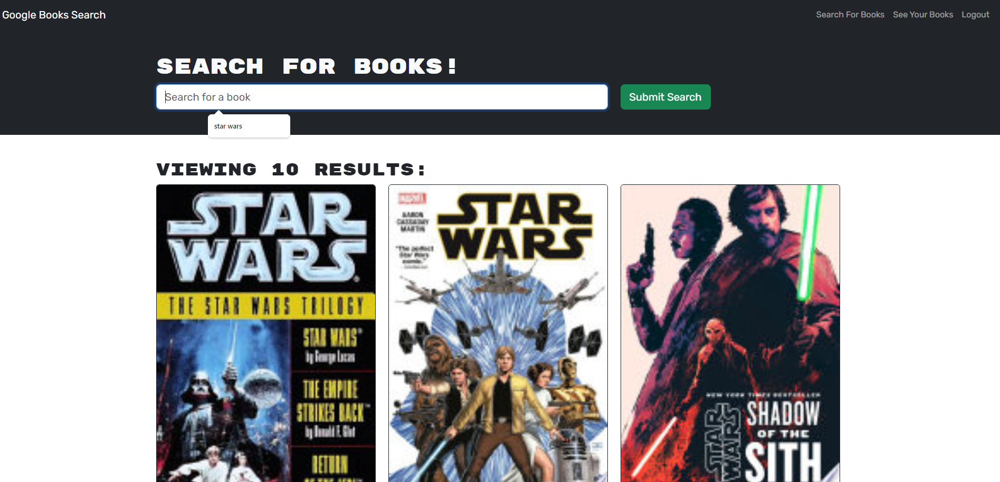

# Book Search Engine

## Description
This is a simple book search engine, powered by the google books API. It can be used to search for books, as well as save them to a personal wishlist.

## Table of Contents
- [Usage](#usage)
- [License](#license)
- [Questions](#questions)

## Usage
To use, navigate to the deployed site at . Books can be searched through the search form input without being signup up or logged in. However, after signing up or logging in, users gain the ability to save searched books to their wishlist. Clicking on 'see your books' leads to a page viewing this wishlist, from which books can also be removed from the wishlist.

## License
This application is covered under the [MIT](./LICENSE) license

## Questions
Github: [kc-claas](https://github.com/kc-claas)

For additional questions, contact keithclaas@gmail.com
